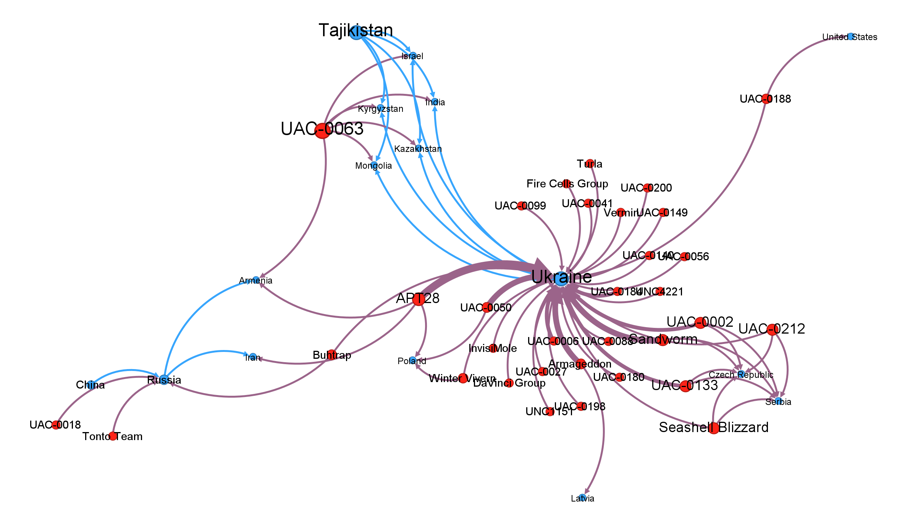
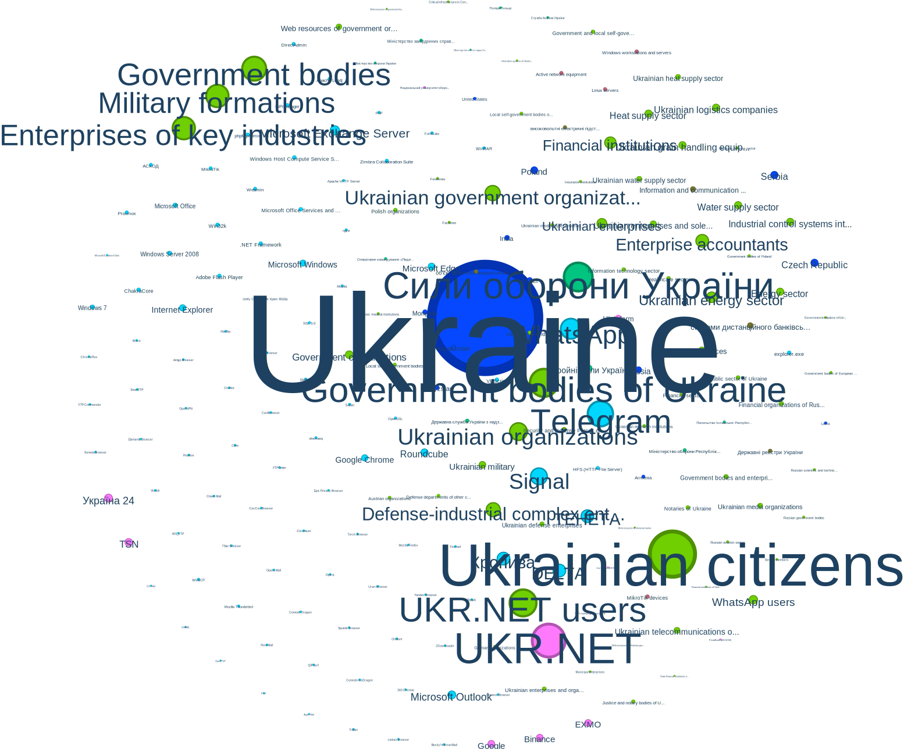
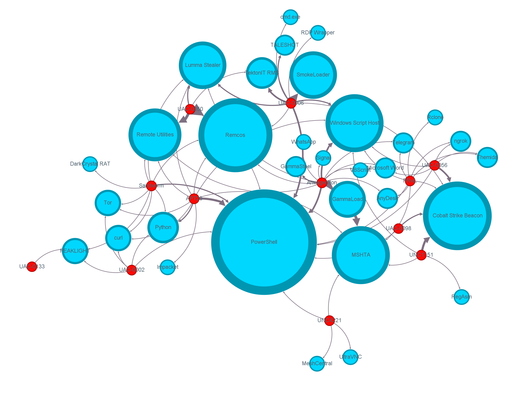

# dissert

## Results

### Attacks Landscape by Hacker Groups (Red) and Countries (Blue)

*Edge thikness represent frequency of attacks*

### Most often targets

*Size represents incoming attacks. Color represent node type*

### Tools Used by Hacker Groups

*Red nodes are hacker groups, blue nodes are tools. Edge thickness represents usage frequency*

# Top Incoming Attacks Analysis

Identifies the top 10 most attacked nodes for each entity type based on incoming attack relationships

**Execution Time:** 0.004s  
**Timestamp:** 2025-09-04T18:40:26.986Z

### KEY METRICS

| Metric                 | Value |
| ---------------------- | ----- |
| totalEntityTypes       | 10    |
| entityTypesWithAttacks | 8     |
| totalNodesAnalyzed     | 2674  |
| attackEdgesFound       | 4528  |

### RESULTS BY ENTITY TYPE - Sector

*(showing 10 of 81)*

| Rank | Label                        | Attacks | Weight | Attackers | Risk |
| ---- | ---------------------------- | ------- | ------ | --------- | ---- |
| 1    | Ukrainian citizens           | 205     | 205.0  | 205       | 7.5  |
| 2    | UKR.NET users                | 119     | 119.0  | 119       | 7.5  |
| 3    | Government bodies of Ukraine | 111     | 118.0  | 111       | 7.5  |
| 4    | Government bodies            | 106     | 106.0  | 106       | 7.5  |
| 5    | Military formations          | 99      | 99.0   | 99        | 5.0  |
| 6    | Enterprises of key industrie | 99      | 99.0   | 99        | 7.5  |
| 7    | Ukrainian organizations      | 75      | 75.0   | 75        | 7.5  |
| 8    | Ukrainian government organiz | 63      | 65.0   | 63        | 7.5  |
| 9    | Defense-industrial complex e | 58      | 58.0   | 58        | 7.5  |
| 10   | Enterprise accountants       | 52      | 54.0   | 52        | 7.5  |

### RESULTS BY ENTITY TYPE - Government Body

*(showing 10 of 11)*

| Rank | Label                        | Attacks | Weight | Attackers | Risk |
| ---- | ---------------------------- | ------- | ------ | --------- | ---- |
| 1    | Сили оборони України         | 123     | 129.0  | 123       | 9.0  |
| 2    | Збройні Сили України         | 22      | 25.0   | 22        | 5.0  |
| 3    | Державна служба України з на | 12      | 12.0   | 12        | 9.0  |
| 4    | Міністерство оборони Республ | 11      | 11.0   | 11        | 9.0  |
| 5    | Міністерство закордонних спр | 9       | 9.0    | 9         | 9.0  |
| 6    | Посольство Ісламської Респуб | 7       | 7.0    | 7         | 9.0  |
| 7    | Оперативне командування «Пів | 7       | 7.0    | 7         | 9.0  |
| 8    | Служба безпеки України       | 6       | 6.0    | 6         | 5.0  |
| 9    | Поліція Польщі               | 6       | 6.0    | 6         | 9.0  |
| 10   | Міністерство оборони України | 6       | 6.0    | 6         | 9.0  |

### RESULTS BY ENTITY TYPE - Domain

*(showing 1 of 1)*

| Rank | Label  | Attacks | Weight | Attackers | Risk |
| ---- | ------ | ------- | ------ | --------- | ---- |
| 1    | gov.ua | 1       | 1.0    | 1         | 8.0  |

### RESULTS BY ENTITY TYPE - Organization

*(showing 10 of 11)*

| Rank | Label                        | Attacks | Weight | Attackers | Risk |
| ---- | ---------------------------- | ------- | ------ | --------- | ---- |
| 1    | UKR.NET                      | 149     | 149.0  | 149       | 8.0  |
| 2    | Україна 24                   | 32      | 32.0   | 32        | 8.0  |
| 3    | TSN                          | 30      | 30.0   | 30        | 8.0  |
| 4    | Google                       | 27      | 27.0   | 27        | 5.0  |
| 5    | EXMO                         | 27      | 27.0   | 27        | 8.0  |
| 6    | Binance                      | 27      | 27.0   | 27        | 8.0  |
| 7    | Ukrinform                    | 20      | 20.0   | 20        | 8.0  |
| 8    | Національний університет обо | 6       | 6.0    | 6         | 8.0  |
| 9    | inq. Nigeria (AS16284)       | 3       | 3.0    | 3         | 8.0  |
| 10   | PrivatBank (AS15742)         | 3       | 3.0    | 3         | 8.0  |

### RESULTS BY ENTITY TYPE - Country

*(showing 10 of 14)*

| Rank | Label          | Attacks | Weight | Attackers | Risk |
| ---- | -------------- | ------- | ------ | --------- | ---- |
| 1    | Ukraine        | 440     | 496.0  | 440       | 8.0  |
| 2    | Serbia         | 29      | 29.0   | 29        | 8.0  |
| 3    | Czech Republic | 29      | 29.0   | 29        | 8.0  |
| 4    | Poland         | 27      | 27.0   | 27        | 8.0  |
| 5    | Russia         | 23      | 23.0   | 23        | 5.0  |
| 6    | India          | 17      | 17.0   | 17        | 5.0  |
| 7    | Mongolia       | 17      | 17.0   | 17        | 8.0  |
| 8    | Kazakhstan     | 17      | 17.0   | 17        | 8.0  |
| 9    | Kyrgyzstan     | 17      | 17.0   | 17        | 8.0  |
| 10   | Israel         | 17      | 17.0   | 17        | 8.0  |

### RESULTS BY ENTITY TYPE - Software

*(showing 10 of 111)*

| Rank | Label                     | Attacks | Weight | Attackers | Risk |
| ---- | ------------------------- | ------- | ------ | --------- | ---- |
| 1    | Telegram                  | 110     | 110.0  | 110       | 8.0  |
| 2    | WhatsApp                  | 87      | 87.0   | 87        | 8.0  |
| 3    | Signal                    | 65      | 65.0   | 65        | 8.0  |
| 4    | DELTA                     | 54      | 54.0   | 54        | 5.0  |
| 5    | ТЕНЕТА                    | 54      | 54.0   | 54        | 6.0  |
| 6    | Кропива                   | 54      | 54.0   | 54        | 6.0  |
| 7    | Microsoft Outlook         | 33      | 33.0   | 33        | 5.0  |
| 8    | Roundcube                 | 28      | 29.0   | 28        | 6.0  |
| 9    | Microsoft Exchange Server | 28      | 28.0   | 28        | 6.0  |
| 10   | Google Chrome             | 26      | 26.0   | 26        | 6.0  |

### RESULTS BY ENTITY TYPE - Infrastructure

*(showing 7 of 7)*

| Rank | Label                        | Attacks | Weight | Attackers | Risk |
| ---- | ---------------------------- | ------- | ------ | --------- | ---- |
| 1    | системи дистанційного банків | 21      | 21.0   | 21        | 8.5  |
| 2    | Information and communicatio | 19      | 19.0   | 19        | 8.5  |
| 3    | об'єкт критичної енергетично | 14      | 14.0   | 14        | 8.5  |
| 4    | Державні реєстри України     | 13      | 13.0   | 13        | 8.5  |
| 5    | високовольтні електричні під | 12      | 12.0   | 12        | 8.5  |
| 6    | DNS-сервери для зони gov.ua  | 3       | 3.0    | 3         | 8.5  |
| 7    | Єдиний державний реєстр декл | 1       | 1.0    | 1         | 8.5  |

### RESULTS BY ENTITY TYPE - Device

*(showing 5 of 5)*

| Rank | Label                        | Attacks | Weight | Attackers | Risk |
| ---- | ---------------------------- | ------- | ------ | --------- | ---- |
| 1    | MikroTik devices             | 13      | 13.0   | 13        | 7.5  |
| 2    | Windows workstations and ser | 12      | 12.0   | 12        | 6.5  |
| 3    | Linux servers                | 12      | 12.0   | 12        | 6.5  |
| 4    | Active network equipment     | 12      | 12.0   | 12        | 6.5  |
| 5    | Unify OpenStage Xpert 6010p  | 7       | 7.0    | 7         | 6.5  |

---

# Highest Weight Edges Analysis

Identifies the top 10 edges with highest weights, both overall and grouped by edge type

**Execution Time:** 0.027s  
**Timestamp:** 2025-09-04T18:40:27.014Z

### KEY METRICS

| Metric             | Value |
| ------------------ | ----- |
| totalEdges         | 81755 |
| maxWeight          | 12    |
| uniqueEdgeTypes    | 8     |
| averageWeight      | 1.01  |
| edgesAboveWeight10 | 2     |
| edgesAboveWeight50 | 0     |

### TOP EDGES (OVERALL)

*(showing 10 of 81755)*

| Rank | Source                         | Target                         | Weight | Type                | Date       |
| ---- | ------------------------------ | ------------------------------ | ------ | ------------------- | ---------- |
| 1    | PowerShell                     | Ukraine                        | 12     | attacks             | 2018-12-13 |
| 2    | Державна служба спеціального з | Ukraine                        | 12     | related_to          | 2019-09-12 |
| 3    | Державний центр кіберзахисту Д | Державна служба спеціального з | 9      | related_to          | 2019-09-12 |
| 4    | Державний центр кіберзахисту Д | Ukraine                        | 8      | related_to          | 2019-09-12 |
| 5    | Національний банк України      | Ukraine                        | 8      | related_to          | 2021-08-03 |
| 6    | UAC-0050                       | Remcos                         | 8      | uses_infrastructure | 2023-02-06 |
| 7    | Сили оборони України           | Ukraine                        | 8      | co_targeted         | 2024-02-22 |
| 8    | UAC-0006                       | SmokeLoader                    | 7      | uses_infrastructure | 2023-05-05 |
| 9    | Government bodies of Ukraine   | Ukraine                        | 6      | co_targeted         | 2019-01-29 |
| 10   | Armageddon                     | GammaLoad                      | 5      | uses_infrastructure | 2022-02-01 |

### EDGES BY TYPE - collaborates_with

*(showing 10 of 61326)*

| Rank | Source              | Target              | Weight | S.Type   | T.Type   |
| ---- | ------------------- | ------------------- | ------ | -------- | -------- |
| 1    | PowerShell          | MSHTA               | 5      | Software | Software |
| 2    | PowerShell          | Windows Script Host | 4      | Software | Software |
| 3    | Windows Script Host | PowerShell          | 4      | Software | Software |
| 4    | SmokeLoader         | PowerShell          | 4      | Software | Software |
| 5    | Remcos              | Remote Utilities    | 4      | Software | Software |
| 6    | PowerShell          | workers.dev         | 3      | Software | Domain   |
| 7    | GammaLoad           | MSHTA               | 3      | Software | Software |
| 8    | Windows Script Host | MSHTA               | 3      | Software | Software |
| 9    | MSHTA               | PowerShell          | 3      | Software | Software |
| 10   | MSHTA               | Windows Script Host | 3      | Software | Software |

### EDGES BY TYPE - mentioned_in_context_of

*(showing 10 of 9056)*

| Rank | Source                         | Target             | Weight | S.Type          | T.Type      |
| ---- | ------------------------------ | ------------------ | ------ | --------------- | ----------- |
| 1    | Центр кібернетичної безпеки ін | Ukraine            | 5      | Government Body | Country     |
| 2    | Ukraine                        | Ukrainian citizens | 4      | Country         | Sector      |
| 3    | Microsoft                      | Ukraine            | 4      | Organization    | Country     |
| 4    | Usoris                         | Remote Utilities   | 4      | Organization    | Software    |
| 5    | Центр кібернетичної безпеки ін | Signal             | 4      | Government Body | Software    |
| 6    | Ukraine                        | Armageddon         | 3      | Country         | HackerGroup |
| 7    | Ukraine                        | PowerShell         | 3      | Country         | Software    |
| 8    | Ukraine                        | MSHTA              | 3      | Country         | Software    |
| 9    | Ukraine                        | yolasite.com       | 3      | Country         | Domain      |
| 10   | Ukraine                        | UAC-0050           | 3      | Country         | HackerGroup |

### EDGES BY TYPE - attacks

*(showing 10 of 4528)*

| Rank | Source     | Target                         | Weight | S.Type      | T.Type          |
| ---- | ---------- | ------------------------------ | ------ | ----------- | --------------- |
| 1    | PowerShell | Ukraine                        | 12     | Software    | Country         |
| 2    | Remcos     | Ukraine                        | 5      | Software    | Country         |
| 3    | Signal     | Ukraine                        | 5      | Software    | Country         |
| 4    | Russia     | Ukraine                        | 4      | Country     | Country         |
| 5    | APT28      | Ukraine                        | 4      | HackerGroup | Country         |
| 6    | Armageddon | Ukraine                        | 3      | HackerGroup | Country         |
| 7    | Armageddon | Government bodies of Ukraine   | 3      | HackerGroup | Sector          |
| 8    | PowerShell | Ukrainian government organizat | 3      | Software    | Sector          |
| 9    | PowerShell | Government organizations       | 3      | Software    | Sector          |
| 10   | PowerShell | Сили оборони України           | 3      | Software    | Government Body |

### EDGES BY TYPE - related_to

*(showing 10 of 2472)*

| Rank | Source                         | Target                         | Weight | S.Type          | T.Type          |
| ---- | ------------------------------ | ------------------------------ | ------ | --------------- | --------------- |
| 1    | Державна служба спеціального з | Ukraine                        | 12     | Government Body | Country         |
| 2    | Державний центр кіберзахисту Д | Державна служба спеціального з | 9      | Government Body | Government Body |
| 3    | Державний центр кіберзахисту Д | Ukraine                        | 8      | Government Body | Country         |
| 4    | Національний банк України      | Ukraine                        | 8      | Government Body | Country         |
| 5    | Служба безпеки України         | Ukraine                        | 5      | Government Body | Country         |
| 6    | Національний банк України      | bank.gov.ua                    | 4      | Government Body | Domain          |
| 7    | Facebook                       | Ukraine                        | 4      | Organization    | Country         |
| 8    | Facebook                       | Національний банк України      | 4      | Organization    | Government Body |
| 9    | Оперативний центр реагування н | Державний центр кіберзахисту Д | 4      | Government Body | Government Body |
| 10   | Ukraine                        | Департамент кіберполіції Націо | 3      | Country         | Government Body |

### EDGES BY TYPE - uses_infrastructure

*(showing 10 of 2193)*

| Rank | Source     | Target               | Weight | S.Type      | T.Type   |
| ---- | ---------- | -------------------- | ------ | ----------- | -------- |
| 1    | UAC-0050   | Remcos               | 8      | HackerGroup | Software |
| 2    | UAC-0006   | SmokeLoader          | 7      | HackerGroup | Software |
| 3    | Armageddon | GammaLoad            | 5      | HackerGroup | Software |
| 4    | Armageddon | MSHTA                | 5      | HackerGroup | Software |
| 5    | UAC-0050   | Remote Utilities     | 5      | HackerGroup | Software |
| 6    | APT28      | PowerShell           | 4      | HackerGroup | Software |
| 7    | UNC1151    | Cobalt Strike Beacon | 4      | HackerGroup | Software |
| 8    | UNC1151    | PicassoLoader        | 4      | HackerGroup | Software |
| 9    | Russia     | PowerShell           | 3      | Country     | Software |
| 10   | Armageddon | PowerShell           | 3      | HackerGroup | Software |

### EDGES BY TYPE - co_targeted

*(showing 10 of 1897)*

| Rank | Source                         | Target                         | Weight | S.Type          | T.Type   |
| ---- | ------------------------------ | ------------------------------ | ------ | --------------- | -------- |
| 1    | Сили оборони України           | Ukraine                        | 8      | Government Body | Country  |
| 2    | Government bodies of Ukraine   | Ukraine                        | 6      | Sector          | Country  |
| 3    | Ukrainian government organizat | Ukraine                        | 3      | Sector          | Country  |
| 4    | Ukrainian citizens             | Telegram                       | 2      | Sector          | Software |
| 5    | Adobe Illustrator              | Adobe Experience Manager       | 2      | Software        | Software |
| 6    | Adobe Illustrator              | VMware Tools                   | 2      | Software        | Software |
| 7    | Adobe Illustrator              | SNMP Subagent Stand-Alone for  | 2      | Software        | Software |
| 8    | Adobe Illustrator              | Chipset Device Software        | 2      | Software        | Software |
| 9    | Adobe Illustrator              | RWC 3 for Windows              | 2      | Software        | Software |
| 10   | Adobe Illustrator              | Processor Graphics             | 2      | Software        | Software |

### EDGES BY TYPE - belongs_to_sector

*(showing 10 of 262)*

| Rank | Source                         | Target                         | Weight | S.Type          | T.Type |
| ---- | ------------------------------ | ------------------------------ | ------ | --------------- | ------ |
| 1    | Департамент кіберполіції Націо | Ukrainian citizens             | 3      | Government Body | Sector |
| 2    | CSIRT-NBU                      | Ukrainian citizens             | 3      | Government Body | Sector |
| 3    | Microsoft                      | Government bodies of Ukraine   | 2      | Organization    | Sector |
| 4    | Microsoft                      | Government bodies              | 2      | Organization    | Sector |
| 5    | Державний центр кіберзахисту Д | Government bodies of Ukraine   | 2      | Government Body | Sector |
| 6    | Державний центр кіберзахисту Д | Government bodies              | 2      | Government Body | Sector |
| 7    | Державна служба спеціального з | Web resources of government bo | 2      | Government Body | Sector |
| 8    | Сили оборони України           | Defense-industrial complex ent | 2      | Government Body | Sector |
| 9    | Адміністрація Держспецзв’язку  | Government institutions of Ukr | 1      | Government Body | Sector |
| 10   | VimpelCom                      | Government institutions of Ukr | 1      | Organization    | Sector |

### EDGES BY TYPE - is_attributed_to

*(showing 10 of 21)*

| Rank | Source     | Target                         | Weight | S.Type      | T.Type          |
| ---- | ---------- | ------------------------------ | ------ | ----------- | --------------- |
| 1    | Armageddon | Russia                         | 3      | HackerGroup | Country         |
| 2    | APT28      | Russia                         | 3      | HackerGroup | Country         |
| 3    | Sandworm   | Russia                         | 2      | HackerGroup | Country         |
| 4    | APT28      | Main Directorate of the Genera | 2      | HackerGroup | Government Body |
| 5    | Turla      | Russia                         | 2      | HackerGroup | Country         |
| 6    | Armageddon | Federal Security Service of Ru | 1      | HackerGroup | Government Body |
| 7    | Sandworm   | Main Directorate of the Genera | 1      | HackerGroup | Government Body |
| 8    | APT41      | China                          | 1      | HackerGroup | Country         |
| 9    | UAC-0082   | Russia                         | 1      | HackerGroup | Country         |
| 10   | UAC-0082   | Main Directorate of the Genera | 1      | HackerGroup | Government Body |

---

# Active Hacker Groups Analysis

Analyzes the top 10 most active hacker groups based on their attack patterns, showing targets, country associations, tools used, and partnerships

**Execution Time:** 0.004s  
**Timestamp:** 2025-09-04T18:40:27.018Z

### KEY METRICS

| Metric                 | Value |
| ---------------------- | ----- |
| totalHackerGroups      | 76    |
| activeHackerGroups     | 64    |
| totalAttackWeight      | 326   |
| topGroupAttackWeight   | 31    |
| groupsWithCountryLinks | 6     |
| groupsWithTools        | 10    |

### 1. APT28 - Attack Weight: 31, Targets: 26, Risk: 9

| Category    | Entity     | Type             | Weight |
| ----------- | ---------- | ---------------- | ------ |
| Top Target  | Ukraine    | Country          | 4      |
|             | Roundcube  | Software         | 2      |
| Attribution | Russia     | is_attributed_to | 3      |
| Main Tool   | PowerShell | Software         | 4      |
| Partner     | Armageddon | HackerGroup      | 1      |

### 2. Sandworm - Attack Weight: 25, Targets: 22, Risk: 9

| Category    | Entity                  | Type             | Weight |
| ----------- | ----------------------- | ---------------- | ------ |
| Top Target  | Ukraine                 | Country          | 3      |
|             | Ukrainian energy sector | Sector           | 2      |
| Attribution | Russia                  | is_attributed_to | 2      |
| Main Tool   | PowerShell              | Software         | 2      |
| Partner     | UAC-0113                | HackerGroup      | 1      |

### 3. Armageddon - Attack Weight: 17, Targets: 13, Risk: 9

| Category    | Entity                       | Type             | Weight |
| ----------- | ---------------------------- | ---------------- | ------ |
| Top Target  | Ukraine                      | Country          | 3      |
|             | Government bodies of Ukraine | Sector           | 3      |
| Attribution | Russia                       | is_attributed_to | 3      |
| Main Tool   | GammaLoad                    | Software         | 5      |
| Partner     | Sandworm                     | HackerGroup      | 1      |

### 4. UAC-0050 - Attack Weight: 15, Targets: 13, Risk: 9

| Category    | Entity                       | Type             | Weight |
| ----------- | ---------------------------- | ---------------- | ------ |
| Top Target  | Ukraine                      | Country          | 3      |
|             | Government bodies of Ukraine | Sector           | 1      |
| Attribution | Russia                       | is_attributed_to | 1      |
| Main Tool   | Remcos                       | Software         | 8      |
| Partner     | Armageddon                   | HackerGroup      | 1      |

### 5. UAC-0133 - Attack Weight: 14, Targets: 13, Risk: 9

| Category   | Entity                  | Type        | Weight |
| ---------- | ----------------------- | ----------- | ------ |
| Top Target | Ukraine                 | Country     | 2      |
|            | Ukrainian energy sector | Sector      | 1      |
| Main Tool  | online.ua               | Domain      | 1      |
| Partner    | Sandworm                | HackerGroup | 1      |

### 6. UAC-0002 - Attack Weight: 14, Targets: 13, Risk: 9

| Category   | Entity                  | Type        | Weight |
| ---------- | ----------------------- | ----------- | ------ |
| Top Target | Ukraine                 | Country     | 2      |
|            | Ukrainian energy sector | Sector      | 1      |
| Main Tool  | PowerShell              | Software    | 1      |
| Partner    | Sandworm                | HackerGroup | 2      |

### 7. UAC-0063 - Attack Weight: 10, Targets: 10, Risk: 9

| Category    | Entity                       | Type             | Weight |
| ----------- | ---------------------------- | ---------------- | ------ |
| Top Target  | Government bodies of Ukraine | Sector           | 1      |
|             | India                        | Country          | 1      |
| Attribution | Russia                       | is_attributed_to | 1      |
| Main Tool   | MSHTA                        | Software         | 2      |
| Partner     | APT28                        | HackerGroup      | 1      |

### 8. Turla - Attack Weight: 9, Targets: 9, Risk: 9

| Category    | Entity                  | Type             | Weight |
| ----------- | ----------------------- | ---------------- | ------ |
| Top Target  | Ukraine                 | Country          | 1      |
|             | Ukrainian energy sector | Sector           | 1      |
| Attribution | Russia                  | is_attributed_to | 2      |
| Main Tool   | KAZUAR                  | Software         | 2      |
| Partner     | Armageddon              | HackerGroup      | 1      |

### 9. UNC4221 - Attack Weight: 9, Targets: 9, Risk: 9

| Category   | Entity     | Type     | Weight |
| ---------- | ---------- | -------- | ------ |
| Top Target | Ukraine    | Country  | 1      |
|            | Telegram   | Software | 1      |
| Main Tool  | PowerShell | Software | 1      |

### 10. Seashell Blizzard - Attack Weight: 9, Targets: 9, Risk: 9

| Category   | Entity         | Type        | Weight |
| ---------- | -------------- | ----------- | ------ |
| Top Target | Ukraine        | Country     | 1      |
|            | Energy sector  | Sector      | 1      |
| Main Tool  | CVE-2024-38213 | Software    | 1      |
| Partner    | UAC-0212       | HackerGroup | 1      |

---

# Attack Tools & Software Analysis

Analyzes software and tools used by hacker groups, showing usage patterns and which groups use which tools

**Execution Time:** 0.006s  
**Timestamp:** 2025-09-04T18:40:27.024Z

### KEY METRICS

| Metric                 | Value |
| ---------------------- | ----- |
| totalToolsInGraph      | 2245  |
| activelyUsedTools      | 1766  |
| toolsWithDirectAttacks | 1187  |
| mostUsedToolUsage      | 38    |
| softwareTools          | 469   |
| domainTools            | 1276  |

### 1. PowerShell (Software) - Usage: 38, Users: 29, Direct Attack Tool

*(showing 5 of 29)*

| Hacker Group | Usage |
| ------------ | ----- |
| APT28        | 4     |
| Armageddon   | 3     |
| UAC-0006     | 3     |
| Sandworm     | 2     |
| UAC-0173     | 2     |

### 2. Remcos (Software) - Usage: 18, Users: 10, Direct Attack Tool

*(showing 5 of 10)*

| Hacker Group | Usage |
| ------------ | ----- |
| UAC-0050     | 8     |
| UAC-0184     | 2     |
| Armageddon   | 1     |
| Sandworm     | 1     |
| UAC-0096     | 1     |

### 3. MSHTA (Software) - Usage: 17, Users: 12, Direct Attack Tool

*(showing 5 of 12)*

| Hacker Group | Usage |
| ------------ | ----- |
| Armageddon   | 5     |
| UAC-0063     | 2     |
| FRwL         | 1     |
| APT28        | 1     |
| UNC1151      | 1     |

### 4. Windows Script Host (Software) - Usage: 14, Users: 11, Direct Attack Tool

*(showing 5 of 11)*

| Hacker Group | Usage |
| ------------ | ----- |
| Armageddon   | 3     |
| UAC-0006     | 2     |
| UAC-0056     | 1     |
| FRwL         | 1     |
| APT28        | 1     |

### 5. Cobalt Strike Beacon (Software) - Usage: 14, Users: 8, Direct Attack Tool

*(showing 5 of 8)*

| Hacker Group | Usage |
| ------------ | ----- |
| UNC1151      | 4     |
| UAC-0056     | 3     |
| UAC-0098     | 2     |
| FRwL         | 1     |
| Z-Team       | 1     |

### 6. Remote Utilities (Software) - Usage: 13, Users: 7, Direct Attack Tool

*(showing 5 of 7)*

| Hacker Group | Usage |
| ------------ | ----- |
| UAC-0050     | 5     |
| UAC-0096     | 3     |
| Armageddon   | 1     |
| Sandworm     | 1     |
| APT28        | 1     |

### 7. Lumma Stealer (Software) - Usage: 10, Users: 8, Direct Attack Tool

*(showing 5 of 8)*

| Hacker Group | Usage |
| ------------ | ----- |
| UAC-0050     | 2     |
| UAC-0006     | 2     |
| Armageddon   | 1     |
| Sandworm     | 1     |
| APT28        | 1     |

### 8. Python (Software) - Usage: 9, Users: 7, Direct Attack Tool

*(showing 5 of 7)*

| Hacker Group | Usage |
| ------------ | ----- |
| APT28        | 2     |
| UAC-0063     | 2     |
| Sandworm     | 1     |
| UAC-0145     | 1     |
| UAC-0002     | 1     |

### 9. ngrok (Software) - Usage: 7, Users: 7, Direct Attack Tool

*(showing 5 of 7)*

| Hacker Group | Usage |
| ------------ | ----- |
| UAC-0056     | 1     |
| FRwL         | 1     |
| Z-Team       | 1     |
| UAC-0118     | 1     |
| Buhtrap      | 1     |

### 10. KAZUAR (Software) - Usage: 7, Users: 6, Direct Attack Tool

*(showing 5 of 6)*

| Hacker Group | Usage |
| ------------ | ----- |
| Turla        | 2     |
| Armageddon   | 1     |
| Sandworm     | 1     |
| APT28        | 1     |
| UAC-0050     | 1     |

### 11. Quasar RAT (Software) - Usage: 7, Users: 6, Direct Attack Tool

*(showing 5 of 6)*

| Hacker Group | Usage |
| ------------ | ----- |
| UAC-0050     | 2     |
| Armageddon   | 1     |
| Sandworm     | 1     |
| APT28        | 1     |
| Turla        | 1     |

### 12. SmokeLoader (Software) - Usage: 7, Users: 1, Direct Attack Tool

*(showing 1 of 1)*

| Hacker Group | Usage |
| ------------ | ----- |
| UAC-0006     | 7     |

### 13. Venom RAT (Software) - Usage: 6, Users: 6, Direct Attack Tool

*(showing 5 of 6)*

| Hacker Group | Usage |
| ------------ | ----- |
| Armageddon   | 1     |
| Sandworm     | 1     |
| APT28        | 1     |
| UAC-0050     | 1     |
| Turla        | 1     |

### 14. PEAKLIGHT (Software) - Usage: 6, Users: 6, Direct Attack Tool

*(showing 5 of 6)*

| Hacker Group      | Usage |
| ----------------- | ----- |
| Sandworm          | 1     |
| UAC-0133          | 1     |
| UAC-0173          | 1     |
| UAC-0002          | 1     |
| Seashell Blizzard | 1     |

### 15. DarkCrystal RAT (Software) - Usage: 6, Users: 5, Direct Attack Tool

*(showing 5 of 5)*

| Hacker Group | Usage |
| ------------ | ----- |
| UAC-0113     | 2     |
| Sandworm     | 1     |
| UAC-0145     | 1     |
| UAC-0173     | 1     |
| UAC-0200     | 1     |

---

# Software Under Attack Analysis

Analyzes software that are targets of attacks, showing which groups and tools are attacking them

**Execution Time:** 0.005s  
**Timestamp:** 2025-09-04T18:40:27.030Z

### KEY METRICS

| Metric                      | Value |
| --------------------------- | ----- |
| totalSoftwareNodes          | 746   |
| softwareUnderAttack         | 111   |
| mostAttackedSoftwareWeight  | 110   |
| averageAttackersPerSoftware | 11.4  |
| softwareWithGroupAttacks    | 24    |
| softwareWithToolAttacks     | 107   |

### 1. Telegram - Attacking Groups (110 attack relations from 2 groups + 108 tools/methods)

*(showing 2 of 2)*

| Hacker Group | Attack Relations | Total Weight | First Attack |
| ------------ | ---------------- | ------------ | ------------ |
| UAC-0094     | 1                | 1            | 2022-04-05   |
| UNC4221      | 1                | 1            | 2024-12-07   |

### Telegram - Attack Methods/Tools

*(showing 8 of 108)*

| Tool/Method        | Type     | Weight |
| ------------------ | -------- | ------ |
| MSHTA              | Software | 1      |
| ohsxy.com          | Domain   | 1      |
| telsec.org         | Domain   | 1      |
| sec-t.info         | Domain   | 1      |
| tgeo.link          | Domain   | 1      |
| cloue.link         | Domain   | 1      |
| me-cloud.link      | Domain   | 1      |
| account.associates | Domain   | 1      |

### Telegram - Associated With

| Entity     | Type    | Weight |
| ---------- | ------- | ------ |
| Ukraine    | Country | 1      |
| Kazakhstan | Country | 1      |
| Montenegro | Country | 1      |

### 2. WhatsApp - Attacking Groups (87 attack relations from 1 groups + 86 tools/methods)

*(showing 1 of 1)*

| Hacker Group | Attack Relations | Total Weight | First Attack |
| ------------ | ---------------- | ------------ | ------------ |
| UNC4221      | 1                | 1            | 2024-12-07   |

### WhatsApp - Attack Methods/Tools

*(showing 8 of 86)*

| Tool/Method                 | Type     | Weight |
| --------------------------- | -------- | ------ |
| MSHTA                       | Software | 1      |
| kyiv.ua                     | Domain   | 1      |
| petition-presidentu.com     | Domain   | 1      |
| president-petition.best     | Domain   | 1      |
| president-petition6504.best | Domain   | 1      |
| president-petition6884.best | Domain   | 1      |
| president-petition9034.best | Domain   | 1      |
| president-petitions.click   | Domain   | 1      |

### WhatsApp - Associated With

| Entity     | Type    | Weight |
| ---------- | ------- | ------ |
| Kazakhstan | Country | 1      |
| Montenegro | Country | 1      |

### 3. Signal - Attacking Groups (65 attack relations from 1 groups + 64 tools/methods)

*(showing 1 of 1)*

| Hacker Group | Attack Relations | Total Weight | First Attack |
| ------------ | ---------------- | ------------ | ------------ |
| UNC4221      | 1                | 1            | 2024-12-07   |

### Signal - Attack Methods/Tools

*(showing 8 of 64)*

| Tool/Method     | Type     | Weight |
| --------------- | -------- | ------ |
| MSHTA           | Software | 1      |
| IDAT            | Software | 1      |
| HijackLoader    | Software | 1      |
| SHADOWLADDER    | Software | 1      |
| GHOSTPULSE      | Software | 1      |
| ViottoKeylogger | Software | 1      |
| XWorm           | Software | 1      |
| SIGTOP          | Software | 1      |

### Signal - Associated With

| Entity     | Type    | Weight |
| ---------- | ------- | ------ |
| Kazakhstan | Country | 1      |
| Israel     | Country | 1      |
| Montenegro | Country | 1      |

### 4. DELTA - Attacking Groups (54 attack relations from 1 groups + 53 tools/methods)

*(showing 1 of 1)*

| Hacker Group | Attack Relations | Total Weight | First Attack |
| ------------ | ---------------- | ------------ | ------------ |
| UNC4221      | 1                | 1            | 2024-12-07   |

### DELTA - Attack Methods/Tools

*(showing 8 of 53)*

| Tool/Method      | Type     | Weight |
| ---------------- | -------- | ------ |
| PowerShell       | Software | 1      |
| MSHTA            | Software | 1      |
| MeshCentral      | Software | 1      |
| UltraVNC         | Software | 1      |
| outloolc.com     | Domain   | 1      |
| redirecl.com     | Domain   | 1      |
| odwebp.com       | Domain   | 1      |
| derzhposluhy.com | Domain   | 1      |

### DELTA - Associated With

| Entity   | Type        | Weight |
| -------- | ----------- | ------ |
| Ukraine  | Country     | 1      |
| UAC-0132 | HackerGroup | 1      |

### 5. ТЕНЕТА - Attacking Groups (54 attack relations from 1 groups + 53 tools/methods)

*(showing 1 of 1)*

| Hacker Group | Attack Relations | Total Weight | First Attack |
| ------------ | ---------------- | ------------ | ------------ |
| UNC4221      | 1                | 1            | 2024-12-07   |

### ТЕНЕТА - Attack Methods/Tools

*(showing 8 of 53)*

| Tool/Method      | Type     | Weight |
| ---------------- | -------- | ------ |
| PowerShell       | Software | 1      |
| MSHTA            | Software | 1      |
| MeshCentral      | Software | 1      |
| UltraVNC         | Software | 1      |
| outloolc.com     | Domain   | 1      |
| redirecl.com     | Domain   | 1      |
| odwebp.com       | Domain   | 1      |
| derzhposluhy.com | Domain   | 1      |

### 6. Кропива - Attacking Groups (54 attack relations from 1 groups + 53 tools/methods)

*(showing 1 of 1)*

| Hacker Group | Attack Relations | Total Weight | First Attack |
| ------------ | ---------------- | ------------ | ------------ |
| UNC4221      | 1                | 1            | 2024-12-07   |

### Кропива - Attack Methods/Tools

*(showing 8 of 53)*

| Tool/Method      | Type     | Weight |
| ---------------- | -------- | ------ |
| PowerShell       | Software | 1      |
| MSHTA            | Software | 1      |
| MeshCentral      | Software | 1      |
| UltraVNC         | Software | 1      |
| outloolc.com     | Domain   | 1      |
| redirecl.com     | Domain   | 1      |
| odwebp.com       | Domain   | 1      |
| derzhposluhy.com | Domain   | 1      |

### 7. Microsoft Outlook - Attacking Groups (33 attack relations from 2 groups + 31 tools/methods)

*(showing 2 of 2)*

| Hacker Group | Attack Relations | Total Weight | First Attack |
| ------------ | ---------------- | ------------ | ------------ |
| JokerDPR     | 1                | 1            | 2023-12-19   |
| UAC-0177     | 1                | 1            | 2023-12-19   |

### Microsoft Outlook - Attack Methods/Tools

*(showing 8 of 31)*

| Tool/Method   | Type     | Weight |
| ------------- | -------- | ------ |
| Agent Tesla   | Software | 1      |
| RegAsm        | Software | 1      |
| WinSCP        | Software | 1      |
| badpdf.com    | Domain   | 1      |
| chinagrill.co | Domain   | 1      |
| vaultcli.dll  | Software | 1      |
| ssl2.link     | Domain   | 1      |
| authcheck.in  | Domain   | 1      |

### 8. Roundcube - Attacking Groups (28 attack relations from 1 groups + 27 tools/methods)

*(showing 1 of 1)*

| Hacker Group | Attack Relations | Total Weight | First Attack |
| ------------ | ---------------- | ------------ | ------------ |
| APT28        | 1                | 2            | 2023-06-20   |

### Roundcube - Attack Methods/Tools

*(showing 8 of 27)*

| Tool/Method    | Type     | Weight |
| -------------- | -------- | ------ |
| PowerShell     | Software | 1      |
| OpenSSL        | Software | 1      |
| CVE-2020-35730 | Software | 1      |
| CVE-2021-44026 | Software | 1      |
| CVE-2020-12641 | Software | 1      |
| e.js           | Software | 1      |
| q.js           | Software | 1      |
| c.js           | Software | 1      |

### Roundcube - Associated With

| Entity         | Type    | Weight |
| -------------- | ------- | ------ |
| United Kingdom | Country | 1      |

### 9. Microsoft Exchange Server - Attacking Groups (28 attack relations from 6 groups + 22 tools/methods)

*(showing 3 of 6)*

| Hacker Group             | Attack Relations | Total Weight | First Attack |
| ------------------------ | ---------------- | ------------ | ------------ |
| HAFNIUM                  | 1                | 1            | 2021-03-17   |
| FRwL                     | 1                | 1            | 2023-08-09   |
| CyberArmyofRussia_Reborn | 1                | 1            | 2023-08-09   |

### Microsoft Exchange Server - Attack Methods/Tools

*(showing 8 of 22)*

| Tool/Method         | Type     | Weight |
| ------------------- | -------- | ------ |
| Windows Script Host | Software | 1      |
| MSHTA               | Software | 1      |
| CVE-2021-34523      | Software | 1      |
| CVE-2021-34473      | Software | 1      |
| CVE-2021-31207      | Software | 1      |
| ProxyShell          | Software | 1      |
| ProxyLogon          | Software | 1      |
| CVE-2018-13379      | Software | 1      |

### Microsoft Exchange Server - Associated With

| Entity  | Type    | Weight |
| ------- | ------- | ------ |
| Ukraine | Country | 1      |

### 10. Google Chrome - Attacking Groups (26 attack relations from 1 groups + 25 tools/methods)

*(showing 1 of 1)*

| Hacker Group | Attack Relations | Total Weight | First Attack |
| ------------ | ---------------- | ------------ | ------------ |
| APT28        | 1                | 1            | 2023-12-28   |

### Google Chrome - Attack Methods/Tools

*(showing 8 of 25)*

| Tool/Method   | Type     | Weight |
| ------------- | -------- | ------ |
| PowerShell    | Software | 1      |
| Agent Tesla   | Software | 1      |
| Impacket      | Software | 1      |
| smbexec       | Software | 1      |
| CVE-2014-3566 | Software | 1      |
| CVE-2015-4000 | Software | 1      |
| CVE-2016-0800 | Software | 1      |
| CVE-2015-0204 | Software | 1      |

### Google Chrome - Associated With

| Entity        | Type    | Weight |
| ------------- | ------- | ------ |
| United States | Country | 1      |

### Internet Explorer - Attack Methods/Tools

*(showing 8 of 26)*

| Tool/Method    | Type     | Weight |
| -------------- | -------- | ------ |
| Agent Tesla    | Software | 1      |
| CVE-2014-3566  | Software | 1      |
| CVE-2015-4000  | Software | 1      |
| CVE-2016-0800  | Software | 1      |
| CVE-2015-0204  | Software | 1      |
| CVE-2017-14491 | Software | 1      |
| CVE-2017-0144  | Software | 1      |
| CVE-2014-0160  | Software | 1      |

### Internet Explorer - Associated With

| Entity        | Type    | Weight |
| ------------- | ------- | ------ |
| United States | Country | 1      |

### Microsoft Edge - Attack Methods/Tools

*(showing 8 of 25)*

| Tool/Method   | Type     | Weight |
| ------------- | -------- | ------ |
| PowerShell    | Software | 1      |
| Impacket      | Software | 1      |
| smbexec       | Software | 1      |
| CVE-2018-8174 | Software | 1      |
| CVE-2018-8120 | Software | 1      |
| CVE-2018-0854 | Software | 1      |
| CVE-2018-0958 | Software | 1      |
| CVE-2018-8124 | Software | 1      |

### Microsoft Windows - Attack Methods/Tools

*(showing 8 of 24)*

| Tool/Method   | Type     | Weight |
| ------------- | -------- | ------ |
| PowerShell    | Software | 1      |
| zakon.rar     | Software | 1      |
| hashcat       | Software | 1      |
| server.com    | Domain   | 1      |
| CVE-2014-3566 | Software | 1      |
| CVE-2015-4000 | Software | 1      |
| CVE-2016-0800 | Software | 1      |
| CVE-2015-0204 | Software | 1      |

### Microsoft Windows - Associated With

| Entity        | Type    | Weight |
| ------------- | ------- | ------ |
| United States | Country | 1      |

### Microsoft Office - Attack Methods/Tools

*(showing 8 of 16)*

| Tool/Method                 | Type     | Weight |
| --------------------------- | -------- | ------ |
| CVE-2017-11882              | Software | 1      |
| major.exe                   | Software | 1      |
| PGMB New Order 18-2077.xlsx | Software | 1      |
| CVE-2018-8174               | Software | 1      |
| CVE-2018-8120               | Software | 1      |
| CVE-2018-0854               | Software | 1      |
| CVE-2018-0958               | Software | 1      |
| CVE-2018-8124               | Software | 1      |

### Windows 7 - Attack Methods/Tools

*(showing 8 of 15)*

| Tool/Method   | Type     | Weight |
| ------------- | -------- | ------ |
| CVE-2019-0708 | Software | 1      |
| RDP           | Software | 1      |
| CVE-2018-8174 | Software | 1      |
| CVE-2018-8120 | Software | 1      |
| CVE-2018-0854 | Software | 1      |
| CVE-2018-0958 | Software | 1      |
| CVE-2018-8124 | Software | 1      |
| CVE-2018-8127 | Software | 1      |

### Windows 7 - Associated With

| Entity        | Type    | Weight |
| ------------- | ------- | ------ |
| United States | Country | 1      |

---

# GPT 5 performance

* GPT-5 Unified extraction takes up to 2:30 minutes per message

**Entities normalization requests**

| Entity Type | Original Count | Normalized Count | Duplicates Merged | Reduction | Processing Time |
| :--- | :--- | :--- | :--- | :--- | :--- |
| Domain | 1,929 | 1,456 | 473 | 24.5% | 29:05.667 |
| Software | 882 | 746 | 136 | 15.4% | 18:32.579 |
| Organization | 174 | 159 | 15 | 8.6% | 3:51.513 |
| Sector | 121 | 94 | 27 | 22.3% | 3:46.112 |
| Government Body | 96 | 59 | 37 | 38.5% | 3:47.760 |
| HackerGroup | 93 | 76 | 17 | 18.3% | 1:35.037 |
| Country | 32 | 24 | 8 | 25.0% | 26.776s |
| Device | 31 | 30 | 1 | 3.2% | 46.025s |
| Individual | 19 | 17 | 2 | 10.5% | 45.326s |
| Infrastructure | 15 | 13 | 2 | 13.3% | 31.372s |
